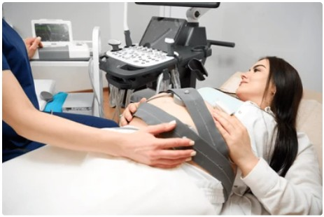

# Detección de anomalías y técnicas de agrupamiento

## Introducción

El análisis de datos clínicos es una herramienta clave en la identificación temprana de riesgos y en el soporte a la toma de decisiones médicas. En este trabajo se emplea el dataset de Cardiotocografía Fetal (CTG) disponible en la plataforma Kaggle, el cual reúne registros obtenidos a partir del monitoreo de la frecuencia cardíaca fetal (FHR) y de las contracciones uterinas (UC). Este conjunto de datos ha sido ampliamente utilizado en estudios de investigación debido a su valor para evaluar la condición fetal y clasificarla en tres categorías clínicas: Normal, Sospechoso y Patológico (NSP).

La riqueza de este dataset radica en la variedad de sus variables numéricas, que permiten un análisis detallado mediante técnicas de exploración, correlación y preprocesamiento de datos. En este contexto, el análisis exploratorio facilita la identificación de tendencias, outliers y patrones en los registros; mientras que la depuración de variables irrelevantes y el tratamiento de valores faltantes aseguran una mejor calidad de los datos. Estos pasos son fundamentales para garantizar una base sólida de cara a la aplicación de modelos de aprendizaje automático orientados a la detección de anomalías y predicción de estados de riesgo fetal.

  

## 1. Objetivos
   
- Objetivo 1: Realizar un análisis exploratorio de datos (EDA) del dataset de cardiotocografía (CTG), identificando las características estadísticas de las variables numéricas y categóricas, así como las correlaciones existentes entre ellas.

- Objetivo 2: Implementar la técnica de detección de anomalías Local Outlier Factor (LOF) para identificar valores atípicos locales que puedan alterar la estabilidad de futuros modelos de regresión o clasificación.

- Objetivo 3: Aplicar el algoritmo de agrupamiento OPTICS para segmentar el dataset en clústeres, interpretando los patrones encontrados y evaluando la calidad de la agrupación generada.

## 2. Desarrollo de la actividad

2.1. EDA - Análisis exploratorio de datos

En esta sección, se presenta una visión integral de las características estadísticas y estructurales del conjunto de datos de cardiotocografía (CTG). El objetivo es comprender la naturaleza de los datos antes de aplicar cualquier modelo de Machine Learning, identificando la distribución de las variables, la presencia de valores atípicos y las relaciones entre ellas.

Descripción del dataset:

El dataset corresponde a registros de cardiotocografía fetal (CTG), una técnica empleada en obstetricia para monitorear la salud del feto durante el embarazo y el parto.

La CTG mide principalmente:

- Frecuencia cardíaca fetal (FHR).

- Contracciones uterinas (UC).

A partir de estas señales se generan variables numéricas que permiten clasificar el estado fetal en tres categorías, representadas por la variable objetivo NSP:

- Normal (1): sin signos de sufrimiento.

- Sospechoso (2): con irregularidades que requieren observación.

- Patológico (3): con signos claros de sufrimiento.

## 3.  s
